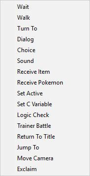

# Custom Events

Custom Events are scripts, usually added to NPCs or other interactables. They are used to make an event tree for the Player to interact with, providing dialogue or cutscenes.

This is a stock Custom Event script, the script may differ from branches however it will function the same:

* Set as busy?
  * Setting this option to false will not cause the Player to enter it's 'busy' state, and will allow free movement and interaction with other interactables.
* Interact Event Trees
  * These trees will be executed when the Player interacts with the collision.
* Bump Event Trees
  * These trees will be executed when the Player bumps into the collision.
* Internal Event Trees
  * These trees will only be executed within the internal code.
  * \[gameObject\].SendMessage\("runInternal",\[SendMessageOptions\]\);
* Demo Event Trees

  * These trees will only be executed when the Player's SaveData is set to be a 'demo' file.

  * SaveData.currentSave.isDemo = \[true\] \|\| SaveLoad.savedGames\[i\].isDemo = \[true\]

* Number of Trees

  * The amount of trees that will be held within the list.

When you add trees to a list, there will be more options to configure for those trees:

* Name of Tree
  * The name of this tree, for convenience sake.
  * This option will not be present for the first \(Default\) event.
* Number of Events
  * The amount of events that will be executed within this tree.

At this time, there are currently 16 events in the latest build of PkUnity \(0.19 at time of writing\),

* Wait
  * Wait for \[x\] seconds
  * \[x\] is a float value.
* Walk
  * Run Simultaneously
    * Runs the event alongside other events.
* TBD, read CustomEvent.cs at around lines 780-800

